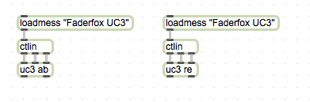

max patch for [faderfox uc3](http://www.faderfox.de/uc3.html) controller

Install as a package then use object [uc3 re] or [uc3 ab] for relative encoder setup or absolute encoder setup.

The first outlet outputs encoders' values and the second one outputs faders' values. The output is a `(i j k)` list where `i` is the group index (1-8),`j` is the encoder/fader index (1-8 for encoders and 1-9 for faders) and `k` is the value. For relative encoder, the `k` is negative for counter-clock rotation.

You need my special setup to use this patch.

misc/ab.midi: the controller setup with absolute encoder value for uc3, playback into uc3 to "flash" the setup to uc3. It will only overwrite the first setup.

misc/re.midi: the controller setup with relative encoder value for uc3, playback into uc3 to "flash" the setup to uc3. It will only overwrite the first setup.
